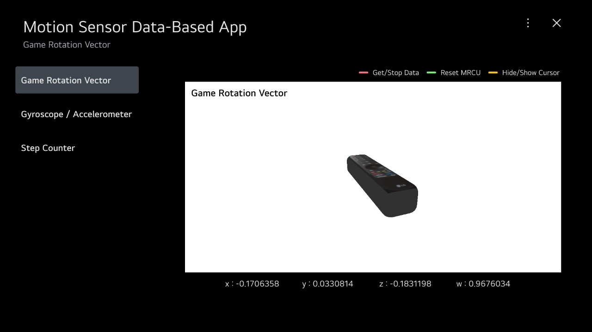
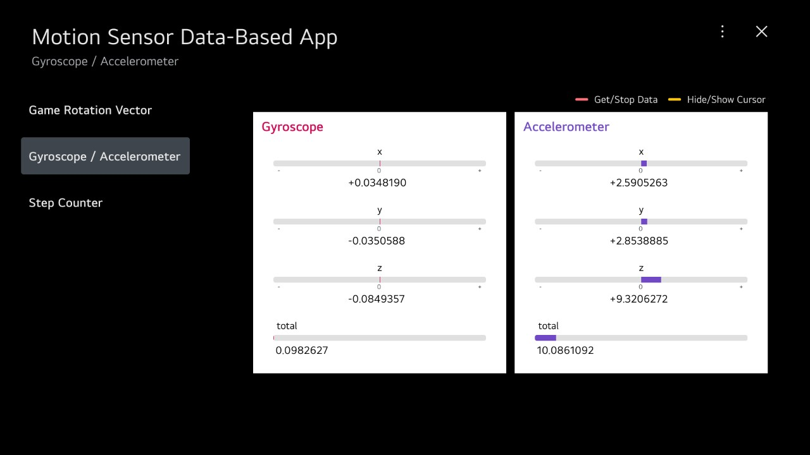
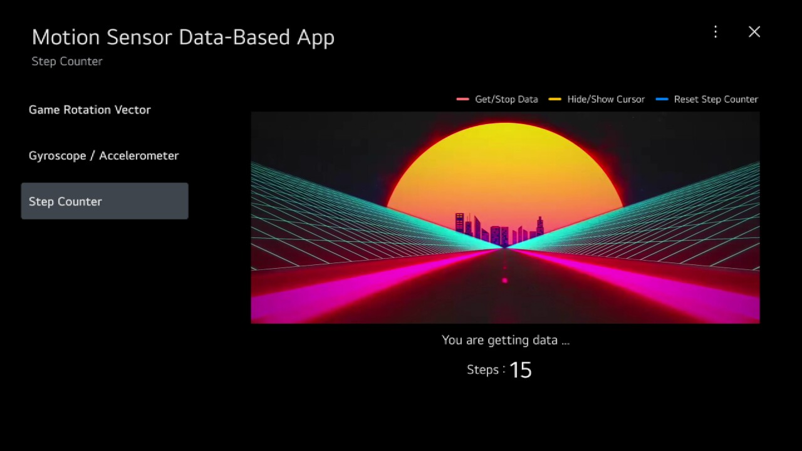

# MrcuSensor

This project is a sample app that uses **MRCU Luna Service API.**

<br/>

## Description

You can find out how to call the luna service API in this project and check the sensor data provided by MRCU. <br/>
This project visualized the sensor data received from MRCU in this following:

- MRCU object rotating by game rotation vector value (quaternion) <br/>
  <br/>
- Graph showing the values of gyroscope and accelerometer <br/>
   <br/>
- Video played when step count increases <br/>
  

<br/>

## Requirements

- webOS 24 latest version and higher
- MRCU pairing
- Internet connection for render MRCU object created by THREE.js

<br/>

## How to Use the Samples

### Clone the Repository

Clone the repository and cd into the cloned directory.

```
git clone https://github.com/webOS-TV-app-samples/MrcuSensor.git
cd MrcuSensor
```

### App Package & Install

Package this project and install it on TV. <br/>

https://webostv.developer.lge.com/develop/tools/cli-dev-guide#ares-package <br/>
https://webostv.developer.lge.com/develop/tools/cli-dev-guide#ares-setup-device <br/>
https://webostv.developer.lge.com/develop/tools/cli-dev-guide#ares-install

<br/>

## Luna Servcie API - MRCU Service

If you want to see details about the MRCU Service API, please refer to this url. <br />
